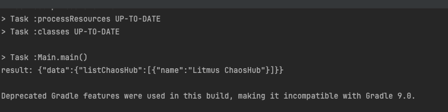
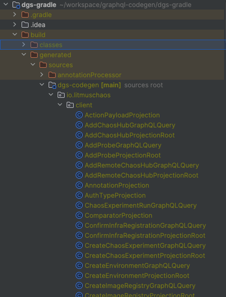

# Reference
- dgs client: https://netflix.github.io/dgs/advanced/java-client/
- dgs code-gen: https://netflix.github.io/dgs/generating-code-from-schema/
- dgs bom: https://netflix.github.io/dgs/advanced/platform-bom/#__tabbed_1_1

# result

# generated code

# 특이사항
- spring과는 독립적으로 구성가능
- generated된 코드를 기존 소스코드에 통합시키는게 아님
  - local 개발할때마다 ./gradlew clean build를 통해 코드 생성
- 편리함